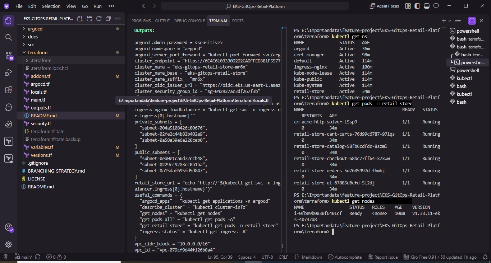
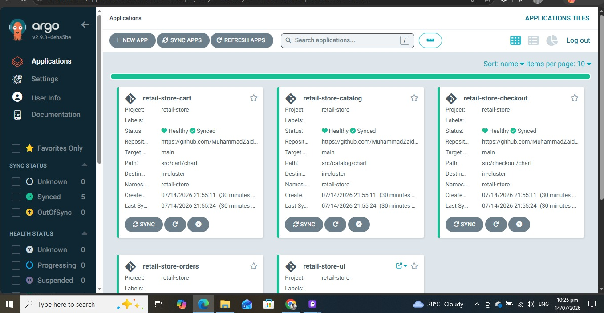
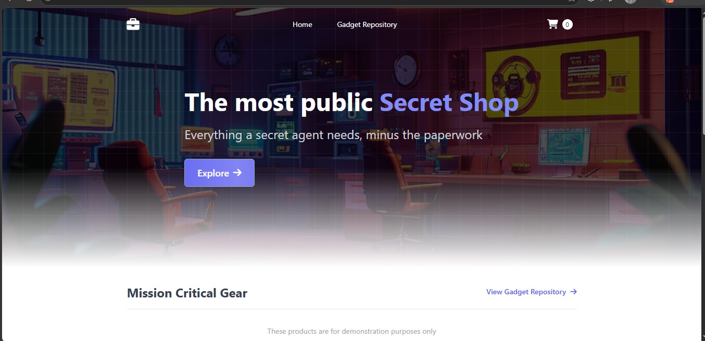

# EKS GitOps Retail Platform

A production-style deployment of a multi-service retail application on **Amazon EKS (Auto Mode)**, provisioned entirely with **Terraform** and deployed using **GitOps** with **ArgoCD**.

> Built as a hands-on project to understand how real DevOps teams take infrastructure and applications from code to a live, running production system — end to end, no manual `kubectl apply`.

---

## Live Architecture

```
Developer commits & pushes to GitHub
        │
        ▼
ArgoCD ── continuously watches the Git repo ── detects manifest changes
        │
        ▼
Amazon EKS (Auto Mode) ── schedules & runs workloads ── AWS manages node scaling
        │
        ▼
NGINX Ingress Controller ── routes external traffic into the cluster
        │
        ▼
cert-manager ── automatically issues & renews TLS certificates via Let's Encrypt (ACME)
```

**5 independent microservices**, each managed as its own ArgoCD Application:

| Service | Helm Chart Path | Status |
|---|---|---|
| cart | `src/cart/chart` | ✅ Healthy / Synced |
| catalog | `src/catalog/chart` | ✅ Healthy / Synced |
| checkout | `src/checkout/chart` | ✅ Healthy / Synced |
| orders | `src/orders/chart` | ✅ Healthy / Synced |
| ui | `src/ui/chart` | ✅ Healthy / Synced |

*(Screenshot of ArgoCD dashboard and live app UI here)*

---



---


---

## Tech Stack

| Category | Tools |
|---|---|
| Cloud Provider | AWS (EKS, VPC, IAM, ELB) |
| Infrastructure as Code | Terraform |
| Container Orchestration | Kubernetes (EKS Auto Mode) |
| GitOps / CD | ArgoCD |
| Networking | NGINX Ingress Controller |
| TLS | cert-manager (Let's Encrypt / ACME) |
| Package Management | Helm |

---

## Repo Structure

```
.
├── terraform/
│   ├── main.tf              # Core cluster + provider config
│   ├── locals.tf            # Local values / naming conventions
│   ├── variables.tf         # Input variables
│   ├── outputs.tf           # Cluster endpoint, useful kubectl commands, etc.
│   ├── addons.tf            # cert-manager, ingress-nginx, ArgoCD as EKS addons
│   ├── argocd.tf            # ArgoCD bootstrap configuration
│   ├── security.tf          # IAM roles, security groups (custom addition)
│   └── versions.tf          # Provider version constraints
├── src/                     # Application source + Helm charts per microservice
├── BRANCHING_STRATEGY.md    # Git branching model used for this project
└── README.md
```

---

## What This Project Demonstrates

- **Infrastructure as Code**: VPC (public + private subnets), EKS cluster, IAM roles, and security groups — all declared in Terraform, fully reproducible and destroyable on demand.
- **True GitOps workflow**: ArgoCD continuously reconciles the live cluster state against Git. Pushing a change to `src/*/chart` is the *only* action needed to deploy — no manual cluster access required.
- **Managed Kubernetes at scale**: EKS Auto Mode handles node provisioning, scaling, and patching automatically — no self-managed node groups.
- **Automated, secure ingress**: All traffic flows through NGINX Ingress with TLS auto-issued and renewed by cert-manager — zero manual certificate handling.
- **Namespace isolation**: `argocd`, `cert-manager`, `ingress-nginx`, and `retail-store` are kept in separate namespaces — a production best practice for blast-radius control.
- **Operational readiness**: Verified via `kubectl describe`, `kubectl logs`, and `kubectl get events` — not just "it's green in the dashboard."

---

## Getting Started

### Prerequisites
AWS CLI v2 (configured), Terraform ≥ 1.5, kubectl, Helm, Docker

### 1. Provision infrastructure
```bash
cd terraform/
terraform init
terraform plan      # always review before applying
terraform apply
```

### 2. Connect to the cluster
```bash
aws eks update-kubeconfig --name <cluster_name> --region us-east-1
kubectl get nodes
```

### 3. Verify everything is running
```bash
kubectl get ns
kubectl get pods -n retail-store
kubectl get applications -n argocd
```

### 4. Access the app
```bash
kubectl get svc -n ingress-nginx
```
Open the `EXTERNAL-IP` / hostname of the load balancer in your browser.

### 5. Tear down (avoid unnecessary AWS charges)
```bash
terraform destroy
```

---

## Lessons Learned

*(Fill in with real issues you hit — this is the section that makes the repo yours, not a tutorial copy)*

-
-
-

---

## Author

**Muhammad Zaid** — Mechanical Engineer transitioning into DevOps & Cloud Engineering, based in Karachi, Pakistan.
[LinkedIn](#) · [GitHub](https://github.com/MuhammadZaid11) · [This Project](https://github.com/MuhammadZaid11/EKS-GitOps-Retail-Platform)

*This project is based on the [retail-store-sample-app](https://github.com/LondheShubham153/retail-store-sample-app) reference architecture, forked and extended with custom Terraform structure, security configuration, and documentation.*
